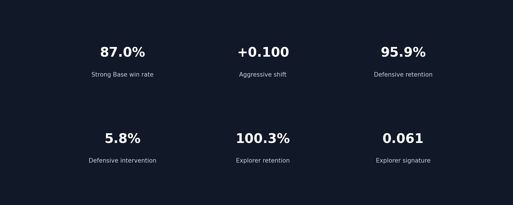
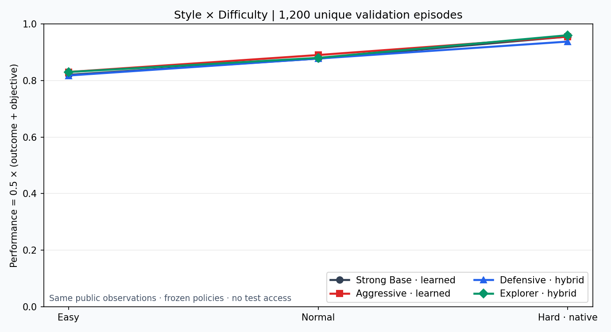
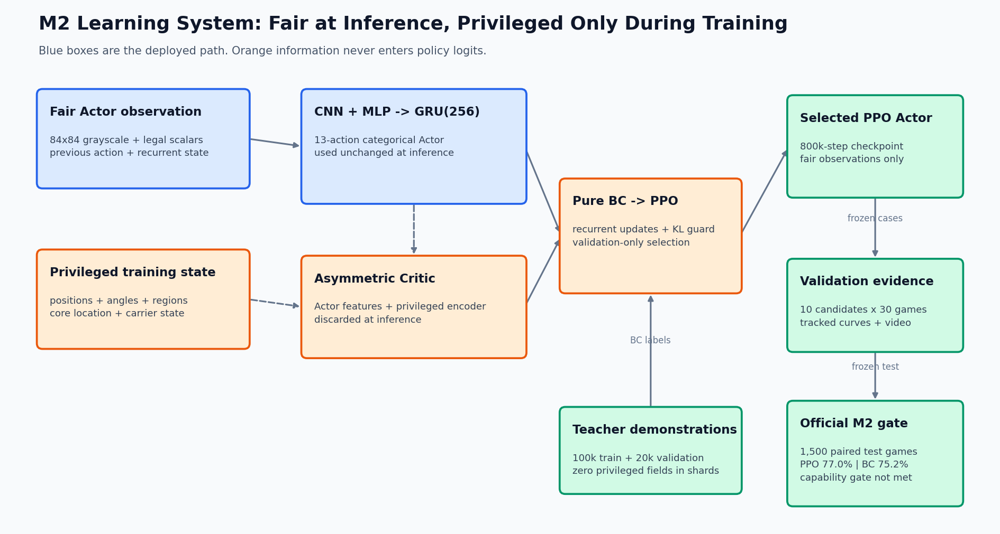
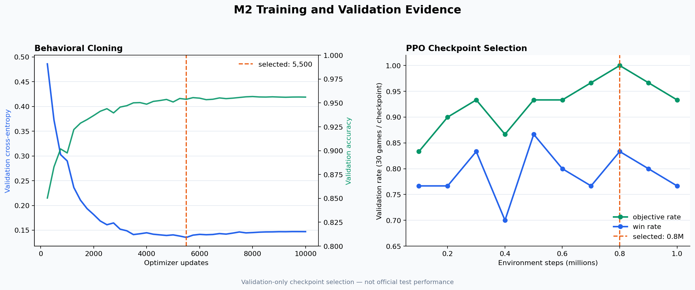
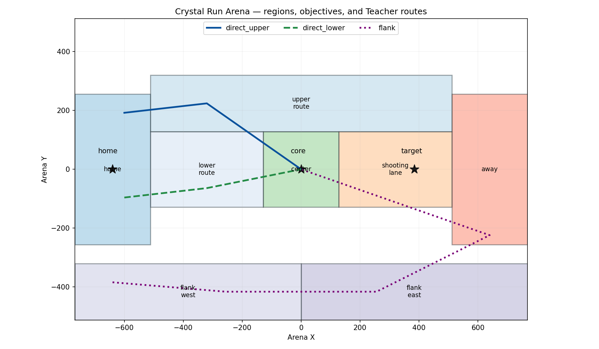

# Bot Colosseo

[中文说明](README_CN.md) · English

Goal-oriented controllable visual game bots via skill-preserving policy shaping.

Bot Colosseo studies how to train a strong visual game Bot and then shape it
into player-recognizable Aggressive, Defensive, and Explorer styles without
discarding its task skill. The approved technical design is in [Plan.md](Plan.md).

Bot Colosseo 研究如何先训练具备稳定任务能力的视觉游戏 Bot，再在保留能力的
前提下塑造玩家可感知的 Aggressive、Defensive 与 Explorer 行为风格。

## Four real policies, one validation case




| Public policy | Implementation | Formal validation evidence |
|---|---|---:|
| Strong Base | learned CNN-GRU | 87.0% win rate |
| Aggressive | learned residual style | +0.100 engagement shift; 100.0% retention |
| Defensive | deterministic public-observation governor over Base | 95.9% retention; 5.8% intervention |
| Explorer | deterministic public-observation governor over Base | 100.3% retention; 0.061 route-action signature |

Defensive and Explorer are deliberately labelled **hybrid governors**, not
reward-shaped RL successes. Their earlier distillation, PPO V1, and
Teacher-assisted PPO V2 failures remain committed. The product-first policies
then completed separate 200-episode paired validation evaluations: every hard
fairness, protocol, retention, intervention, coverage, and executed-action
signature gate passed. The unchanged legacy style metrics remain visible
diagnostics and still do not pass every original learned-policy gate.

The displayed case was selected automatically from the formal ledgers before
rendering; it was not hand-picked from videos. See the full
[Strong Base](docs/assets/showcase/hybrid-strong-base.mp4),
[Aggressive](docs/assets/showcase/hybrid-aggressive.mp4),
[Defensive](docs/assets/showcase/hybrid-defensive.mp4), and
[Explorer](docs/assets/showcase/hybrid-explorer.mp4) episodes, plus the
[hash-bound publication manifest](reports/showcase/hybrid-product/manifest.json).
All are validation artifacts, not official test claims.

## Strong Base → Aggressive


| Frozen validation evidence | Result |
|---|---:|
| Strong Base win rate | 87.0% |
| Aggressive win rate | 89.0% |
| Aggressive engagement shift | +0.100 / 100 decisions |
| Skill Retention | 100.0% |
| Paired evaluation | 200 episodes |

The Aggressive Bot is a fixed residual-style checkpoint derived from the same
fair-observation Strong Base. It passed all seven predefined style, safety, and
retention gates: the engagement-shift bootstrap interval is `[0.046, 0.171]`,
valid-attack rate is 26.7%, and objective-chase rate is controlled at 9.0%.

This GIF is a qualitative, automatically selected **validation** case—not an
official test result. See the [full Strong Base episode](docs/assets/showcase/m4-strong-base.mp4),
[full Aggressive episode](docs/assets/showcase/m4-aggressive.mp4),
[metric card](docs/assets/showcase/m4-metrics.png), and
[hash-bound publication manifest](reports/showcase/m4/manifest.json).

## Fair Easy / Normal / Hard control



The frozen learned and hybrid policies were evaluated in a
`4 policies × 3 tiers × 100 cases` validation matrix. Performance is monotonic
from Easy to Hard for every policy and for at least four of five opponents per
policy. All 1,200 unique episodes passed source-identity, protocol, objective,
style-coverage, and same-tier hybrid-retention gates; the minimum
per-opponent retention was 92.3%, with zero protocol inconsistencies and no
test access. Hard is the native policy; Normal and Easy add only bounded
public-observation inference restrictions. See the
[evidence record](docs/milestones/m5-difficulty.md).

## Current status

Milestone 1 passed its frozen capability gate. Milestone 2 delivered a real
synchronous 1v1 environment, a fair-observation recurrent Actor, 120,000
demonstration transitions, pure-BC initialization, and a 1,000,000-step PPO
run. Its official 1,500-game paired test is complete and integrity-clean, but
the frozen capability gate did **not** pass: PPO clearly beat RandomLegal but
did not improve enough over the strong BC baseline. No M2 capability-pass claim
is made here.





| M2 training artifact | Validation evidence | Selected checkpoint |
|---|---:|---:|
| Behavioral cloning | 95.61% action accuracy | update 5,500 |
| Recurrent PPO | 100% objective rate, 83.33% win rate (30 games) | 800k steps |

These are validation-only selection numbers. See the
[PPO-versus-BC validation showcase](docs/assets/m2-policy-comparison.mp4),
[M2 evidence record](docs/milestones/m2.md), and tracked
[training summaries](reports/m2/). The showcase uses the selected checkpoints
on one frozen validation seed; it is qualitative rather than an official
performance sample.

| Official M2 test (500 games/policy) | Win rate | Objective rate |
|---|---:|---:|
| PPO | 77.0% | 93.2% |
| Behavioral cloning | 75.2% | 97.8% |
| RandomLegal | 34.4% | 22.0% |

The complete paired rows and frozen gate decisions are tracked in
[`reports/m2/`](reports/m2/). Historical-opponent/PFSP training is now the M3
route for testing whether robustness can improve beyond this M2 plateau. That
run completed with clean integrity evidence but did not pass every frozen M3
capability threshold; its selected 200k checkpoint is therefore described as
an integrity-qualified capability anchor, not an official M3 pass.

Milestone 1 established the source-built Crystal Run scenario, auditable ACS
event protocol, fair single-agent interface, five deterministic Teachers,
frozen evaluation manifests, and a 500-episode held-out capability report.



| Capability | Teacher | Test success | Required |
|---|---|---:|---:|
| Navigation | Fixed Route | 100/100 | ≥95% |
| Pickup | Objective First | 100/100 | ≥95% |
| Return | Evasive Return | 100/100 | ≥95% |
| Static hit | Aggressive Script | 100/100 | ≥90% |
| Moving hit | Aggressive Script | 100/100 | ≥75% |

The official report records zero event-protocol inconsistencies. See the
[Teacher montage](docs/assets/m1-teacher-montage.mp4), [M1 runbook](docs/milestones/m1.md),
and [raw evidence](reports/m1/summary.json).

The learned Aggressive checkpoint and its M4 validation gate are complete.
[Defensive](docs/milestones/m5-defensive.md) and
[Explorer](docs/milestones/m5-explorer.md) retain their failed learned-policy
routes, including the stopped Teacher-assisted 50k pilots. The approved
product-first route now wraps the exact Strong Base with deterministic
public-observation governors. Defensive passed its 200-episode product
evaluation at 95.9% Skill Retention; Explorer Candidate C passed at 100.3%,
with all three modes exercised and a 0.061 executed-action signature distance.
Difficulty control now passes the complete 1,200-episode all-style validation
matrix. The remaining Showcase-ready gate is the anonymous recognition study.
A hybrid-aware package containing 22.9 MB of policy artifacts, now including
the difficulty audit,
M6 metrics, and result card, also passed its standalone hash, loader, evidence,
and portability audit; model binaries and raw decision ledgers remain outside
normal Git history. The tracked [release record](reports/m6/hybrid-release.json)
and [raw-evidence record](reports/m6/hybrid-difficulty-evidence-release.json)
bind both upload archives to SHA-256.

## Quick start

```bash
conda env create -f env.yml
conda activate botcolosseo
python scripts/check_env.py
python -m pytest -v
ACC_PATH=/path/to/acc ACC_INCLUDE=/path/to/acc/source \
  python scripts/build_crystal_run.py --check
python scripts/smoke_crystal_run.py \
  --task moving_hit \
  --teacher aggressive_script \
  --record videos/m1-smoke.mp4 \
  --require-video
python scripts/plot_m2_training.py
```

Use `python scripts/evaluate_m1.py --split test --output reports/m1` to reproduce
the full frozen M1 gate. It runs 500 real ViZDoom episodes. M2 commands and the
strict official artifact audit are documented in the
[M2 evidence record](docs/milestones/m2.md) and [`script.md`](script.md).

## Licensing

Bot Colosseo source code is MIT licensed. ViZDoom and Freedoom retain their own
licenses; see [THIRD_PARTY_NOTICES.md](THIRD_PARTY_NOTICES.md). This repository
does not distribute commercial Doom assets.
