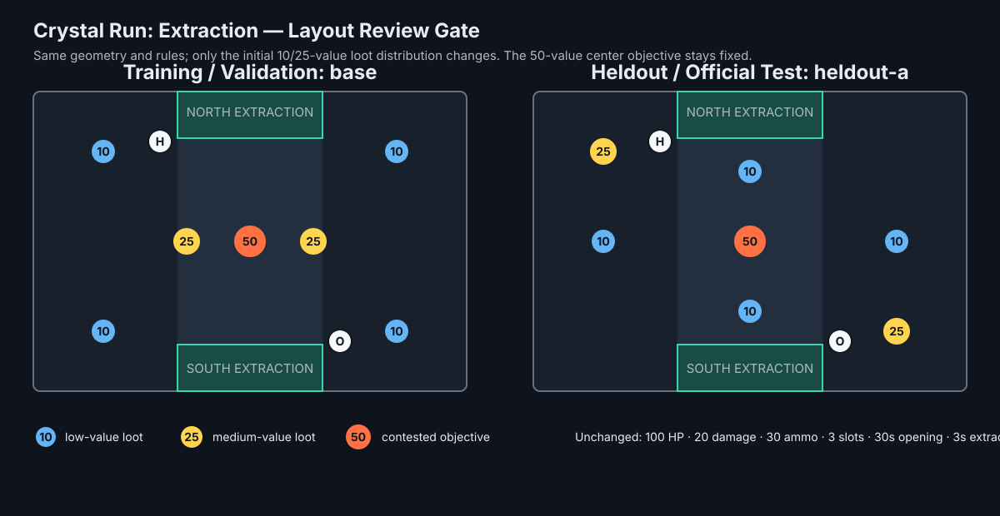

# Crystal Run: Extraction

[中文](README_CN.md)

Train one capable visual game Bot, then shape it into recognizable play styles
without throwing away its task skill.

Crystal Run: Extraction is a compact 1v1 extraction-shooter research product
built in real ViZDoom:

```text
search for loot -> fight or disengage -> manage a 3-slot backpack
                -> reach either extraction zone -> bank value
```

The project is about product-facing agent behavior, not a new RL algorithm. It
combines a fair-observation recurrent policy, asymmetric training, scripted
opponents, historical self-play, lightweight PFSP, and learned residual style
adapters into one auditable workflow.

> Status: the v3 environment, training stack, evaluation protocol, release
> guards, and end-to-end short preflight are complete. Full Strong/style
> experiments are running next; no benchmark-success claim is made before the
> frozen gates pass.

## The game

- Two players, two neutral extraction zones, one 75-second raid.
- Extraction opens at 30 seconds and requires a continuous 3-second hold.
- Each player has 100 HP; every valid hit deals exactly 20 damage.
- Each player starts with 30 rounds. There is no reload and no respawn.
- The backpack has three slots. Loot values are 10, 25, or 50.
- Better loot deterministically replaces the lowest-value carried item.
- Death creates a lootable corpse cache.
- Kills score nothing. Only value carried through extraction is banked.

Training and normal validation use the `base` loot layout. Heldout validation
and the one frozen official test use the approved `heldout-a` distribution:



## The four Bots

| Policy | Intended visible behavior | Implementation |
|---|---|---|
| Strong | win, survive, collect value, and extract reliably | CNN-GRU Actor, BC warm start, recurrent PPO, scripted pool, historical checkpoints, PFSP |
| Aggressive | create useful engagements and convert kills into extracted cache value | bounded learned delta-logit adapter over Strong |
| Defensive | disengage under risk and preserve carried value without empty camping | bounded learned delta-logit adapter over Strong |
| Explorer | visit useful new loot regions, upgrade the backpack, and still extract | bounded learned delta-logit adapter over Strong |

All three styles derive from the exact same frozen Strong Actor hash. There are
no runtime behavior governors in the v3 policies.

## Fair observation boundary

The deployed Actor receives only:

- its 84×84 first-person grayscale frame;
- its own public health, ammunition, backpack, banked value, extraction state,
  remaining time, and previous action.

The Actor never receives opponent HP, opponent position, world coordinates,
automap, depth, object labels, privileged protocol state, or viewer overlays.
During training only, the Critic and reward/evaluation ledgers may use
privileged state. Public inference exports the Actor alone.

## Training and evaluation

```text
Strong Teacher demonstrations
          |
          v
behavioral cloning -> recurrent PPO -> historical checkpoints + PFSP
          |
          v
one selected Strong Actor hash
          |
          +----------+-----------+
          v          v           v
     Aggressive  Defensive   Explorer
       adapter     adapter     adapter
```

Candidate selection never accesses test cases:

- 240 paired validation episodes per policy;
- 120 heldout-layout episodes per policy where required;
- exactly one frozen 400-episode official test per policy;
- 1,600 official-test episodes in total.

The test runner creates a release lock before the first test episode, supports
infrastructure-safe resume for that same immutable release, and refuses a
second completed official test.

Strong must meet every frozen capability threshold before style training is
accepted. Each style must retain at least 85% of paired Strong successes,
remain within 10 percentage points of Strong extraction rate, retain at least
85% of Strong mean extracted value, and show a positive paired style shift
with a 95% confidence bound.

## Reproduce

The project environment is `botcolosseo`. Long-run commands, resume behavior,
selection, official-test locking, and media generation are documented in
[script.md](script.md).

Short verification:

```bash
conda activate botcolosseo
python -m pip check
python -m ruff check src tests scripts
python -m pytest tests/unit -q

python scripts/build_crystal_run_extraction.py \
  --check \
  --acc "$ACC_ROOT/build/acc" \
  --acc-include "$ACC_ROOT"
```

The approved technical and release gates are recorded in [Plan.md](Plan.md).

## Repository map

```text
assets/scenarios/crystal_run_extraction/  ViZDoom map, ACS rules, two layouts
configs/extraction/                       frozen train and evaluation protocols
src/botcolosseo/agents/                   recurrent Actor-Critic and adapters
src/botcolosseo/training/                 BC, PPO, rewards, rollout, PFSP, resume
src/botcolosseo/evaluation/               paired metrics and frozen gates
src/botcolosseo/demo/                     viewer-only telemetry and replay capture
scripts/run_extraction_v3_*.sh            reproducible long-stage entrypoints
```

## License

Project source is MIT licensed. ViZDoom and Freedoom retain their respective
licenses. No commercial Doom assets are distributed; see
[THIRD_PARTY_NOTICES.md](THIRD_PARTY_NOTICES.md).
