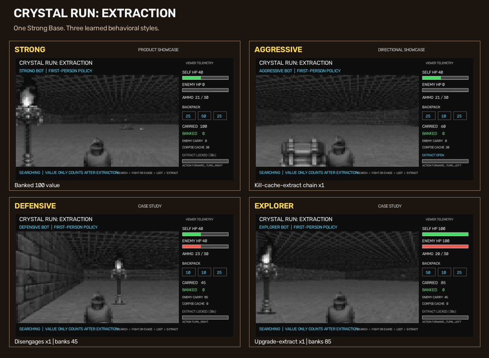
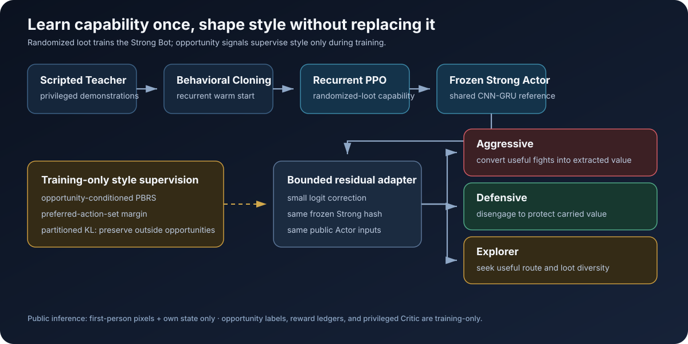

# Crystal Run: Extraction

[中文说明](README_CN.md)

Train one capable first-person game Bot, then derive three visibly different
learned play styles without changing the game rules or giving the Actor hidden
state.



## Watch the Bots

Every clip is the **first-person view of the Bot controlling the camera**.
Judge that camera Bot—not the opponent visible on screen. The right-hand panel
is viewer-only telemetry and is never a policy input.

| Bot | What to watch | Clip | Evidence tier |
|---|---|---|---|
| **Strong** | collects high-value loot and converts it into banked value | [MP4](docs/assets/extraction/strong.mp4) | research selection |
| **Aggressive** | lands five 20-HP hits, creates and loots the enemy corpse cache, then extracts | [MP4](docs/assets/extraction/aggressive.mp4) | directional Showcase |
| **Defensive** | creates safe distance under risk, avoids a kill, and preserves value through extraction | [MP4](docs/assets/extraction/defensive.mp4) | validation demonstration |
| **Explorer** | searches multiple loot regions, upgrades a full backpack, avoids combat, and extracts | [MP4](docs/assets/extraction/explorer.mp4) | validation demonstration |

The videos are selected from a frozen 240-case validation protocol. Rendering
replays the same preselected case at most five times and writes media only when
the actual trajectory completes the advertised causal chain.

## The task

Crystal Run is a compact 1v1 extraction shooter built in real ViZDoom:

```text
search for loot -> fight or disengage -> manage a 3-slot backpack
                -> reach either extraction zone -> bank value
```

- One 75-second raid, two neutral extraction zones.
- Extraction opens after 30 seconds and requires a continuous 3-second hold.
- Each player has 100 HP; every valid hit deals exactly 20 damage.
- Each player starts with 30 rounds; there is no reload and no respawn.
- The backpack has three slots. Loot is worth 10, 25, or 50; a better item
  replaces the lowest-value item when the backpack is full.
- Death drops all unbanked loot into a corpse cache that the opponent can take.
- A kill has no intrinsic score. Only value carried through extraction counts.

The Actor chooses among 13 macro actions: idle; move forward/backward; strafe
left/right; turn left/right; forward-turn combinations; and attack while
standing, moving forward, or turning. Five valid hits eliminate a full-health
opponent.

## One base, three learned styles



The shared **Strong** policy is a visual CNN-GRU trained with scripted Teacher
behavioral cloning, recurrent PPO, historical checkpoints, and lightweight
PFSP opponent sampling. Aggressive, Defensive, and Explorer are small bounded
residual logit adapters trained over the exact same frozen Strong Actor hash:

```text
style_logits = strong_logits + max_delta * tanh(delta(features))
```

- **Aggressive:** useful encounter initiation and
  hit → kill → cache → extraction conversion.
- **Defensive:** low-resource disengagement and meaningful value preservation,
  with penalties for empty camping and fighting while carrying high value.
- **Explorer:** useful loot-region coverage, backpack upgrades, and
  upgrade → extraction conversion—not raw wandering or extraction alone.

All three adapters use the same frozen Strong Actor hash; the public Actor has
no runtime behavior governors.

## Fair observation

The deployed Actor receives only its 84×84 first-person grayscale frame and
its own public HP, ammunition, backpack, banked value, extraction state, timer,
and previous action. The Actor never receives opponent HP or position, world
coordinates, depth, labels, automap, privileged protocol state, or the viewer
overlay.

During training only, a privileged Critic and reward/evaluation ledgers may be
used. Public inference exports the Actor only.

## Evidence, without overclaiming

The Strong checkpoint passes the frozen research gate: 100% solo extraction,
89.2% scripted-opponent win rate, 94.6% validation extraction, and 85.8%
heldout-layout extraction.

Style artifacts use explicit evidence tiers:

- `research_selection`: all frozen validation and heldout gates pass;
- `directional_showcase`: product direction and capability pass, with named
  research failures disclosed;
- `validation_demonstration`: paired validation direction, capability,
  anti-hacking, and protocol checks pass, while heldout failures remain
  visible.

Aggressive has a +0.101 paired validation style shift with 93.5% paired task
retention; its CI lower bound and one heldout opponent-retention check fail.
Defensive has a +0.006 paired validation style shift, 96.3% paired task
retention, and +1.3 percentage-point validation extraction delta; its CI lower
bound fails and its heldout extraction delta is −11.7 percentage points.
Explorer has a +0.050 paired validation style shift, 94.4% paired task
retention, and +0.8 percentage-point validation extraction delta; its heldout
extraction delta is −17.5 percentage points. These artifacts are product
Showcase evidence, not official-test results.

This is a product Showcase with no benchmark-success claim for all styles.
Candidate selection never accesses the test split.

The machine-readable [Showcase audit](reports/extraction/showcase/audit.json)
binds every video, case, model hash, evidence tier, disclosed failed check, and
render-attempt ledger. The strict all-style research release and single-use
official test are deliberately deferred. The deferred protocol allows one frozen 400-episode official test per policy
(1,600 episodes total), but it has not been run.

## Reproduce

Use the `botcolosseo` Conda environment. Full training, resume, selection, and
media commands are in [script.md](script.md).

```bash
conda activate botcolosseo
python -m pip check
python -m ruff check src tests scripts
python -m pytest tests/unit -q

python scripts/build_crystal_run_extraction.py \
  --check \
  --acc "$ACC_ROOT/build/acc" \
  --acc-include "$ACC_ROOT"
```

The frozen task and product gates are documented in [Plan.md](Plan.md).

## License

Project source is MIT licensed. ViZDoom and Freedoom retain their respective
licenses. No commercial Doom assets are distributed; see
[THIRD_PARTY_NOTICES.md](THIRD_PARTY_NOTICES.md).
