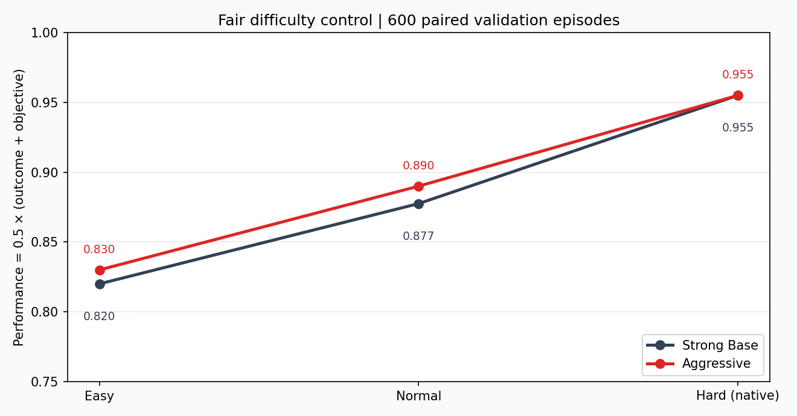

# Bot Colosseo

中文说明 · [English](README.md)

通过能力保持的策略塑形，构建目标导向、风格可控的视觉游戏 Bot。

Bot Colosseo 研究一个面向真实产品的问题：先训练具备任务能力的
fair-observation 视觉 Bot，再从同一个 Base checkpoint 派生玩家能够感知的
Aggressive、Defensive 与 Explorer 风格，同时把 Difficulty 作为独立控制维度。
完整技术方案见 [Plan.md](Plan.md)。

## 四个真实策略，同一个 validation case


| 公开策略 | 实现 | 正式 validation 证据 |
|---|---|---:|
| Strong Base | learned CNN-GRU | 胜率 87.0% |
| Aggressive | learned residual style | engagement shift +0.100；retention 100.0% |
| Defensive | Base 上的确定性公开观测 governor | retention 95.9%；intervention 5.8% |
| Explorer | Base 上的确定性公开观测 governor | retention 100.3%；路线动作签名 0.061 |

Defensive 与 Explorer 被明确标注为 **hybrid governor**，不会冒充
reward-shaped RL 成功。此前 distillation、PPO V1 和 Teacher-assisted PPO V2
的失败结果全部保留。产品优先策略随后各自完成 200 局配对 validation：
公平性、协议、能力保持、干预边界、覆盖与真实执行动作签名门禁全部通过。
未修改的旧风格指标继续作为诊断公开，其中仍有部分 learned-policy 门未通过。

展示 case 由正式 ledger 在渲染前自动选择，不是看完视频后人工挑选。完整视频：
[Strong Base](docs/assets/showcase/hybrid-strong-base.mp4)、
[Aggressive](docs/assets/showcase/hybrid-aggressive.mp4)、
[Defensive](docs/assets/showcase/hybrid-defensive.mp4)、
[Explorer](docs/assets/showcase/hybrid-explorer.mp4)，以及
[hash-bound 发布清单](reports/showcase/hybrid-product/manifest.json)。
这些都是 validation 展示，不是 official test 声明。

## Strong Base → Aggressive


| 冻结 validation 证据 | 结果 |
|---|---:|
| Strong Base 胜率 | 87.0% |
| Aggressive 胜率 | 89.0% |
| Aggressive engagement shift | +0.100 / 100 decisions |
| Skill Retention | 100.0% |
| 配对评测规模 | 200 局 |

Aggressive Bot 是从同一个 fair-observation Strong Base 派生的固定残差风格
checkpoint。它通过了预先定义的七项风格、安全和能力保持门禁：
engagement-shift 的 95% bootstrap 区间为 `[0.046, 0.171]`，有效攻击率为
26.7%，objective-chase rate 控制在 9.0%。

上方 GIF 是自动选择的定性 **validation** 案例，不是 official test 结果。
完整证据包括 [Strong Base 单局视频](docs/assets/showcase/m4-strong-base.mp4)、
[Aggressive 单局视频](docs/assets/showcase/m4-aggressive.mp4)、
[指标卡](docs/assets/showcase/m4-metrics.png)和
[hash-bound 发布清单](reports/showcase/m4/manifest.json)。

## 公平的 Easy / Normal / Hard 控制



同一组冻结 checkpoint 从 Easy 到 Hard 逐步减少推理限制。Strong Base performance
为 `0.820 → 0.878 → 0.955`，Aggressive 为
`0.830 → 0.890 → 0.955`。600 局正式 validation 的六项冻结门均通过，环境重试
和协议错误均为 0。Hard 是原生策略；Normal 增加一个 decision 的反应延迟；
Easy 增加两个 decision 的延迟，并且每两个 decision 才更新一次策略。

这是 Strong Base/Aggressive controller calibration 的通过结果，不是完整的
全风格 difficulty 声明。Defensive 与 Explorer 已通过 hybrid 产品门，但冻结的
全风格 difficulty 扩展仍待运行。详见
[证据记录](docs/milestones/m5-difficulty.md)。

## 产品与技术主线

```text
Teacher demonstrations
        ↓
BC warm start → recurrent visual PPO
        ↓
historical opponents / PFSP capability anchor
        ↓
skill-preserving residual policy shaping
        ↓
Aggressive / Defensive / Explorer checkpoints
        ↓
independent Easy / Normal / Hard controller
        ↓
paired metrics + blind user evaluation
```

Actor 在推理时只接收 `84×84` 第一人称灰度画面、自身公开变量、比分、剩余
时间、是否持有核心和上一动作。敌方坐标、region ID、automap、depth、labels
等特权信息不得进入 Actor。Teacher、reward、Critic 和离线评测可以使用特权
状态，但其边界由类型、前向接口测试和 evidence audit 共同约束。

## 当前证据状态

| 里程碑 | 结果 | 证据边界 |
|---|---|---|
| M1 Crystal Run 与 Teacher | PASS | 5 项能力各 100/100，协议错误 0 |
| M2 真实同步 1v1 与初始 PPO | FAIL | 工程完整，但 PPO 未达到相对 BC +10pp |
| M3 historical/PFSP Strong Base | 未通过全部能力门 | 仅称 integrity-qualified capability anchor |
| M4 Aggressive | PASS | 200 局 validation，风格与 retention 七项门均通过 |
| M5 Defensive / Explorer / Difficulty | 部分通过 | 两个 hybrid 产品正式门通过；全风格 difficulty 待完成 |
| M6 公开发布 | 进行中 | 四策略真实媒体已发布；匿名用户评测与 release 待完成 |

M2 的 official 1,500 局配对 test 工程门完整且协议干净，但能力门没有通过：
PPO 胜率 77.0%，BC 为 75.2%，RandomLegal 为 34.4%；PPO objective rate
为 93.2%，BC 为 97.8%。仓库不会把工程闭环包装成 benchmark 成功。

M3 完成了 historical pool、PFSP、cross-play、候选选择与证据审计，但没有
通过全部冻结能力阈值，因此 200k checkpoint 仅作为后续风格塑形的 capability
anchor。

M4 已形成可信的 learned-style 垂直闭环。Defensive 与 Explorer 的
distillation、200k PPO V1 与 Teacher-assisted 50k V2 未通过 learned-policy
风格门，按冻结规则停止且完整保留。经审核批准的产品优先路线改用 exact Strong
Base 加公开观测、确定性、干预有界的 governor。Defensive 200 局正式产品门以
95.9% retention 通过；Explorer Candidate C 以 100.3% retention、三模式覆盖和
0.061 真实执行动作签名距离通过。完整正负证据分别见
[Defensive 记录](docs/milestones/m5-defensive.md)和
[Explorer 记录](docs/milestones/m5-explorer.md)。

## 快速开始

```bash
conda env create -f env.yml
conda activate botcolosseo
python scripts/check_env.py
python -m pytest -v

ACC_PATH=/path/to/acc ACC_INCLUDE=/path/to/acc/source \
  python scripts/build_crystal_run.py --check

python scripts/smoke_crystal_run.py \
  --task moving_hit \
  --teacher aggressive_script \
  --record videos/m1-smoke.mp4 \
  --require-video
```

复现完整 M1 冻结门禁：

```bash
python scripts/evaluate_m1.py --split test --output reports/m1
```

它会运行 500 个真实 ViZDoom episode。M2 及后续训练、评测、审计、PID、日志和
长实验命令集中记录在 [script.md](script.md)；各里程碑的可读结论位于
[`docs/milestones/`](docs/milestones/)。

## 公平性与可复现性

- train / validation / test case 与随机种子隔离；
- paired evaluation 固定 opponent、seed、side 和 case；
- checkpoint、配置、scenario、ledger、summary 与媒体均记录 SHA-256；
- production publication 拒绝 dirty worktree、失败门禁和 test-derived 素材；
- 完整失败结果不删除，不在看到结果后修改冻结阈值；
- 演示素材明确标注 validation，与 official test 结果分开。

## 许可

Bot Colosseo 源代码采用 MIT License。ViZDoom 与 Freedoom 保留各自许可，详见
[THIRD_PARTY_NOTICES.md](THIRD_PARTY_NOTICES.md)。本仓库不分发商业 Doom
素材。
