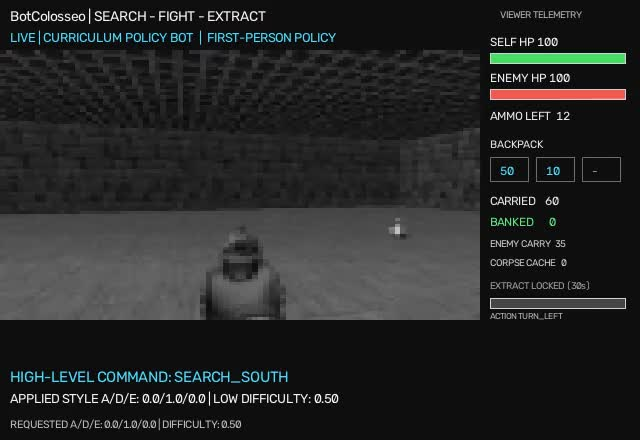
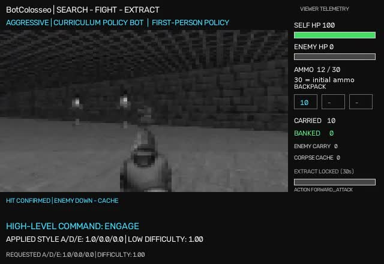
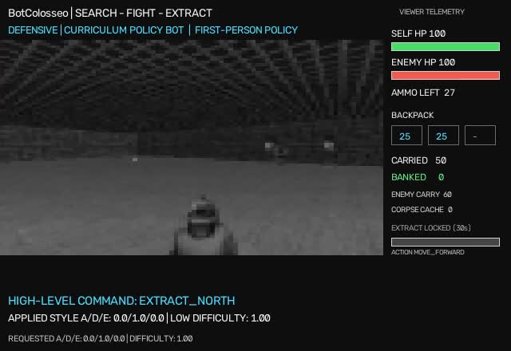
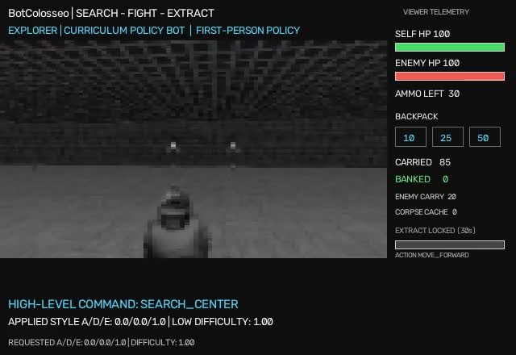
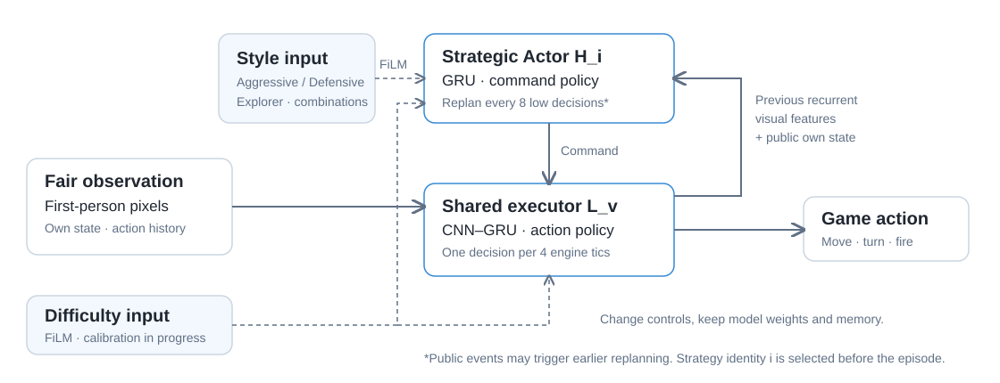

# BotColosseo

### 面向搜打撤的实时可控 Game Bot

**同一策略，三种风格，局内实时调节。**

[**观看在线展示 →**](https://kirin-dev.github.io/BotColosseo/) · [English](README.md) · [正式版本](https://github.com/kirin-dev/BotColosseo/releases/tag/v0.1.0) · [代码指南](docs/hierarchical-research.md)

基于 ViZDoom 的第一视角游戏智能体：高层选择目标，共享视觉执行器输出动作；
在对局中改变风格与难度，不更换模型权重，也不清空记忆。

## 先看效果

| 实时控制 | Aggressive · 进攻 |
|:---:|:---:|
| [](https://kirin-dev.github.io/BotColosseo/#styles) | [](https://kirin-dev.github.io/BotColosseo/#top) |
| 改变风格与难度 → 撤离带出 **60** | 消除威胁 → 继续搜索 → 带出 **85** |
| **Defensive · 防守** | **Explorer · 探索** |
| [](https://kirin-dev.github.io/BotColosseo/#top) | [](https://kirin-dev.github.io/BotColosseo/#top) |
| 获得物资 → 寻找撤离 → 带出 **50** | 搜索 → 三次拾取 → 带出 **85** |

四段视频共享同一高层 Actor、执行器和冻结对手，是精选案例，不代表平均表现。
[查看视频身份与引擎事件](docs/assets/hierarchical/curriculum-showcase.json)

## 游戏任务

搜索物资 → 交战或脱离 → 撤离 → 结算带出价值。

- **75 秒 1v1**，两个中立撤离点；双方都可以撤离。
- **100 HP**，每次有效命中 **20 伤害**，初始 **30 发子弹**；不换弹、不复活。
- **三格背包**，物资价值 10 / 25 / 50；高价值物资自动替换最低价值物资。
- 死亡掉落未带出物资；任务只奖励自己的带出价值，击杀不是撤离前提。

地图几何固定，7 件物资在 16 个点位构成的有限布局族中变化。
这是随机物资场景，不是程序化随机地图。

## 技术路线



| 模块 | 职责 |
|---|---|
| **高层规划** | GRU 选择搜索区域、接战、脱离或两个撤离点，共七类命令。 |
| **共享执行器** | CNN–GRU 根据第一视角观测与命令，输出移动、转向、射击动作。 |
| **实时条件控制** | 有界 FiLM 将风格注入高层，将难度注入两层；切换时保留权重和记忆。 |

**训练链路：** Teacher 示范 → 命令 BC／保守执行器 PPO → 高层条件蒸馏 →
随机条件段风格／难度 PPO。初始化包含偏好目标，不宣称风格由 PSRO 自发涌现。

Actor 仅使用第一视角画面、自身公开状态和历史。敌方隐藏状态、观众遥测不进入策略；
特权监督和 Critic 输入仅用于训练。

## 量化结果

**难度：192 局开发验证，同一冻结部署策略。**

| 输入 | 平均带出价值 | 正价值带出率 |
|---|---:|---:|
| Easy | **21.33** | 67.19% |
| Normal | **32.34** | 81.25% |
| Hard | **38.20** | 85.94% |

**风格：相同首次切换后时间窗口，固定 Hard。**

| 决策步占比 | Aggressive | Defensive | Explorer |
|---|---:|---:|---:|
| 攻击动作 | **8.43%** | 0.00% | 0.21% |
| 搜索命令 | 78.94% | 52.23% | **95.21%** |
| 撤离命令 | 4.11% | **47.77%** | 4.79% |

六种切换顺序共 96 局，复用 16 个布局／角色案例。行为占比不是成功率。
以上属于开发验证：不能推断每种风格难度都单调，也未证明切换提升收益或独立泛化。

[难度数据](docs/assets/hierarchical/task-difficulty.json) · [风格数据](docs/assets/hierarchical/counterbalanced-styles.json) · [完整发布范围](docs/hierarchical-release.md)

## 运行代码

使用 Python 3.10，并按机器配置安装合适的 PyTorch。

```bash
python -m pip install -e ".[training,dev]"
python -m pytest tests/unit -q
python -m botcolosseo.cli.evaluate_hierarchical_styles --help
python -m botcolosseo.cli.render_hierarchical --help
```

本次发布**源码与展示证据**，不包含预训练权重和原始训练轨迹；
实际 rollout 需要本地生成的模型与数据。入口见[架构与代码指南](docs/hierarchical-research.md)。

<details>
<summary>路线演进与研究边界</summary>

固定物资 Bot → 随机物资残差风格 → 共享层级实时控制。
未来可探索 VLM 高层规划和拟人化，但不属于已交付能力。

已实现 PSRO 和执行器升级实验，但可靠响应增益与正式执行器晋级尚未证实，
不声称全部研究门通过。

早期 Strong／残差 Adapter 指标属于另一套部署策略：
[历史基线](docs/adapter-baseline_CN.md) · [旧版视频](https://kirin-dev.github.io/BotColosseo/adapter.html)。

</details>

---

源码采用 MIT License；ViZDoom 与 Freedoom 保留各自许可证。
详见[第三方声明](THIRD_PARTY_NOTICES.md)。
