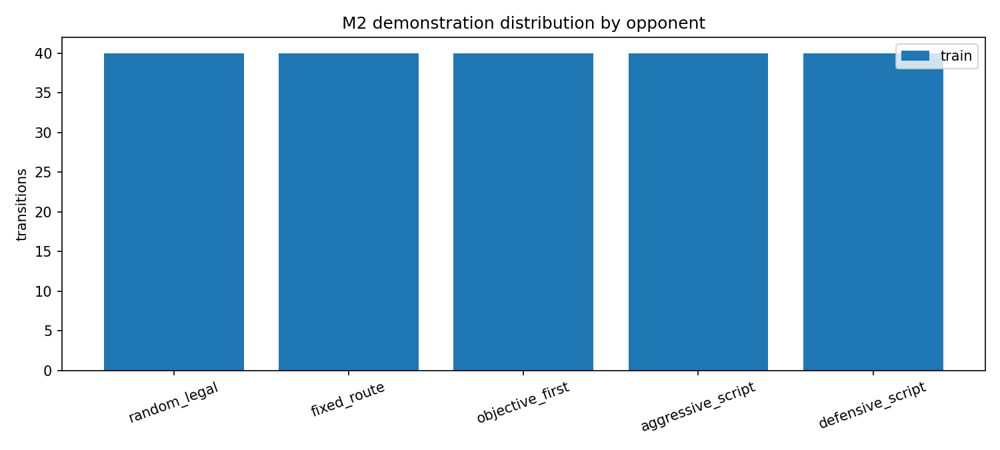

# Milestone 2: learned Bot in synchronous 1v1

M2 training and its official paired test are complete. The 1,500-game artifact
is integrity-clean, but the frozen capability gate did not pass because PPO did
not improve enough over the strong BC baseline. This page separates verified
engineering/training evidence from that negative capability result.

## What is implemented

- A two-process synchronous duel environment advances both players by the same
  four game tics per decision.
- The learned Actor receives only its own `84x84` RGB frame, legal game
  variables, previous action, and recurrent state. Script-state coordinates and
  opponent internals remain outside the Actor boundary.
- A source-built Crystal Run duel supports five frozen opponents and paired,
  side-swapped train/validation/test schedules.
- The learning path is pure behavioral cloning followed by recurrent PPO with
  an auxiliary privileged Critic input used only during training.


The diagram is generated from a tested node/edge specification. In particular,
the only direct Actor input edge comes from the legal observation, while the
privileged state connects only to the training-time Critic:

```bash
PYTHONPATH=src python scripts/render_m2_system_diagram.py
```

The synchronization audit and dual-perspective smoke artifact are tracked as
[`reports/m2/sync-audit.json`](../../reports/m2/sync-audit.json) and
[`m2-sync-duel.mp4`](../assets/m2-sync-duel.mp4).

The selected checkpoints are also shown side by side on one frozen validation
case in the [`PPO versus BC video`](../assets/m2-policy-comparison.mp4). Both
policies face the same RandomLegal opponent seed; PPO finishes three scoring
cycles in 161 decisions and BC in 295. This is a qualitative showcase, not an
official performance sample. Its case, checkpoint, and video hashes are in the
[`comparison manifest`](../../reports/m2/policy-comparison.json). Reproduce it
with:

```bash
PYTHONPATH=src python scripts/render_m2_showcase.py --device cuda:0
```

## Demonstration dataset



The generated dataset contains exactly 100,000 training and 20,000 validation
transitions, balanced evenly across the five opponent types. Its frozen schema
contains the grayscale Actor frame, legal scalars, previous and Teacher actions,
sequence boundaries, masks, opponent/task IDs, and seed provenance. The
recursive schema audit found zero privileged-field leaks, and generation did
not open the test manifest.

Full NPZ shards remain ignored because they are reproducible and large. The
tracked [`demonstration manifest`](../../reports/m2/demonstrations-manifest.json)
contains every shard hash, frame-excluding trajectory hash, case-manifest hash,
schema, transition count, action distribution, and opponent distribution. The
exact generation and artifact audit commands are retained in
[`script.md`](../../script.md#verified-m2-full-demonstration-generation).

## Training evidence


The plot is generated only from the tracked
[`BC training summary`](../../reports/m2/bc-training-summary.json) and
[`PPO training summary`](../../reports/m2/ppo-training-summary.json):

```bash
PYTHONPATH=src python scripts/plot_m2_training.py
```

### Behavioral cloning

The full BC run loaded 100,000 training and 20,000 validation transitions,
completed 10,000 optimizer updates, and selected update 5,500 using objective
completion first and validation loss second. The selected model reached
95.61% validation action accuracy; its checkpoint SHA-256 is
`7eef23a06ea7177d5090ba90be65f8f2f1a847ecb15d81035c21a7e4567949d4`.
A closed-loop validation case completed all three pickup-and-score cycles.

### Recurrent PPO

The full PPO run completed 1,000,000 environment steps, 15,628 finite updates,
and 3,466 episodes. Its training objective-completion rate was 91.46%; maximum
approximate KL was 0.01941 against the frozen 0.03 guard, with no KL early
stop. Validation-only selection compared ten checkpoints over 30 games each.
The 800,000-step checkpoint was the only candidate with 100% validation
objective completion and was selected by the frozen lexicographic rule. It
recorded 83.33% validation win rate and mean score difference 1.433; its
checkpoint SHA-256 is
`41bc3040faf260f928d2b14cf970d6e338fc56f3d80d0df50742b774d51d6647`.

One ViZDoom respawn timeout interrupted training at 898,304 steps. The run
resumed from the atomic checkpoint and finished without missing or duplicated
rollouts; this recovery and the retained traceback are disclosed in the PPO
summary rather than hidden.

## Official paired gate: complete, capability not passed

The frozen official evaluator ran exactly 1,500 test games: PPO, BC, and
RandomLegal against five opponents, with 50 seed-pairs per opponent and both
learner sides. Checkpoint selection used validation only and did not access an
official test episode. The result was:

| Policy | Win rate | Objective rate | Mean score difference |
|---|---:|---:|---:|
| PPO | 77.0% | 93.2% | 1.444 |
| BC | 75.2% | 97.8% | 1.408 |
| RandomLegal | 34.4% | 22.0% | 0.110 |

PPO passed the frozen margin over RandomLegal. It did not pass the required
margin over BC, the objective-rate improvement over BC, the per-opponent floor,
or the positive paired-score lower-confidence-bound gate. The result is
therefore useful negative evidence rather than an M2 capability pass. All 1,500
rows, the manifest, and the summary are tracked under [`reports/m2/`](../../reports/m2/).
The exact launch and recovery commands remain in [`script.md`](../../script.md).
The machine audit is available as a reusable command:

```bash
PYTHONPATH=src python scripts/audit_m2_evidence.py
```

It rejects partial files, missing gates, incorrect row counts,
duplicates, policy/opponent imbalance, broken side swaps, hash drift, checkpoint
selection drift, dirty evaluation provenance, and a missing evaluation commit.
It reports artifact integrity and capability as separate decisions so a clean
negative result cannot be mistaken for corruption or a passing model.

## Checkpoint distribution

The selected BC and PPO files are currently retained under the ignored local
`runs/m2/` tree (approximately 16 MiB and 17 MiB). Their exact SHA-256 values
are tracked above and in the training summaries, so this worktree can run the
frozen evaluator without ambiguity. A clean clone cannot yet download those
weights because this repository has no configured GitHub remote or Release.

The two hash-verified files will either be attached to a versioned GitHub
Release or deliberately published with an artifact mechanism supported by the
final remote. Download URLs and a hash-checking command must be added before M2
is called reproducible from a clean checkout. Generated
optimizer snapshots and unselected candidates will remain unpublished.

## Scope boundary

M2 establishes the first learned visual Bot and its fair multiplayer evaluation
protocol. It does not claim the M3 Strong Base/PFSP robustness gate, difficulty
control, or the Aggressive, Defensive, and Explorer style checkpoints; those
remain subsequent milestones.
