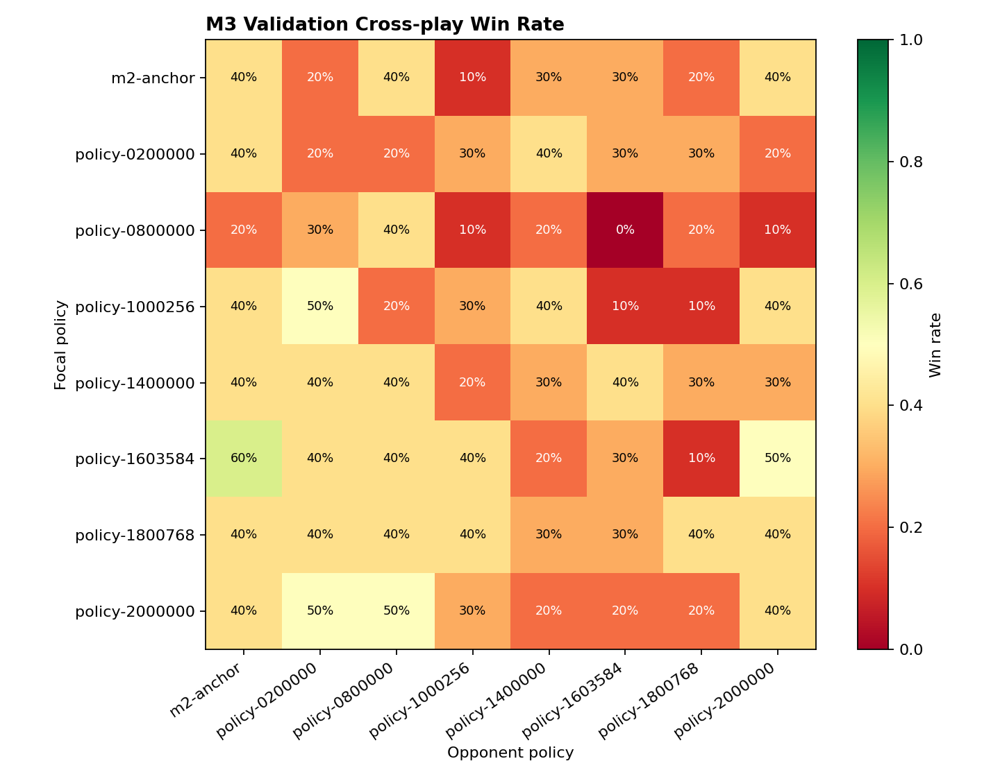
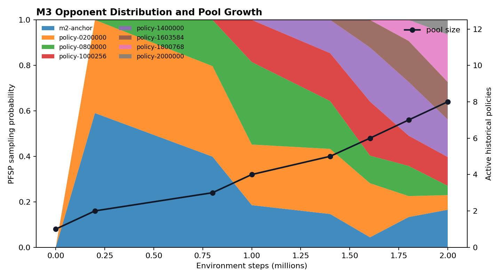

# Milestone 3 — Auditable League and Strong Base

## Official status: M3: FAIL

M3 completed its engineering and evidence workflow: 2,000,000 league-training
environment steps, an immutable eight-policy historical pool, validation-only
candidate admission and selection, a 360-game final cross-play matrix, and all
1,340 frozen official evaluation episodes. The evidence is integrity-clean,
but the frozen capability gate did not pass.

The selected policy is `policy-0200000`, checkpoint SHA-256
`fe45838aa3184a41741755e4ddb2a9582af887f637e6475a25523aa2a358c29a`.
Selection used validation evidence only; M3 test rows were opened once after
the pool reached the required size of eight.

## Frozen gate result

| Gate | Official result | Required | Status |
|---|---:|---:|---:|
| Script-average win rate | 90.2% | ≥70% | PASS |
| Worst script-opponent win rate | 67.0% | ≥55% | PASS |
| No-opponent full objective | 100.0% | ≥90% | PASS |
| Held-out full objective | 99.0% | ≥80% | PASS |
| Paired historical score-difference LCB | +0.10 | ≥0.00 | PASS |
| Historical worst-case win rate | 12.5% vs M2 15.0% | Strict improvement | **FAIL** |

The only false summary gate is `historical_worst_case_improved`. The selected
policy's paired historical score difference improved over M2, but its minimum
win rate against one historical policy was 12.5%, below the M2 baseline's
15.0%. This distinction is preserved rather than averaged away.

## Integrity evidence

| Evidence property | Result |
|---|---:|
| Official episodes | 1,340 / 1,340 |
| Protocol inconsistencies | 0 |
| Artifact inconsistencies | 0 |
| Environment retries | 0 |
| Historical pool size | 8 |
| Final cross-play rows | 360 |

The [raw episode ledger](../../reports/m3/official/episodes.jsonl),
[official summary](../../reports/m3/official/summary.json),
[hash manifest](../../reports/m3/official/manifest.json), and
[run identity](../../reports/m3/official/run-identity.json) allow the result to
be recomputed independently. Candidate selection remains recorded in the
[validation-only selection report](../../reports/m3/strong-base-selection.json).





The heatmap is derived from the
[final cross-play CSV](../../reports/m3/final-crossplay/crossplay.csv); the
canonical numeric matrix is available in
[`reports/m3/crossplay-matrix.json`](../../reports/m3/crossplay-matrix.json).

## Reproduce the closure audit

```bash
export PYTHONPATH="$PWD/src"
python scripts/audit_m3_evidence.py \
  --report-dir reports/m3/official \
  --integrity-only
python scripts/render_m3_evidence.py \
  --official-report-dir reports/m3/official \
  --crossplay-csv reports/m3/crossplay.csv \
  --pool-history reports/m3/pool-history.json
```

The integrity audit returns `integrity_passed: true`,
`capability_passed: false`, and the exact failed gate. Strict audit continues
to return nonzero.

## Forward use

The legal-observation policy runtime, league checkpoints, pool, evaluation
protocol, and visualization pipeline remain usable engineering artifacts. The
validation-selected checkpoint may seed style experiments as a **style base
candidate**, but the project does not describe it as a passed Strong Base.
Aggressive, Defensive, and Explorer work must report its own skill-retention
evidence and retain this limitation until the historical worst-case gap is
repaired.
